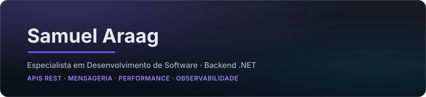

<picture>
  <source media="(prefers-color-scheme: light)" srcset="assets/header-light.svg">
  
</picture>

 

Mais de 4 anos em desenvolvimento de software, com progressão de estagiário a especialista na mesma empresa. Atuação em sistemas fiscais transacionais de alto volume, com C# e .NET 8, APIs REST e mensageria com Kafka, RabbitMQ e AWS SQS, sobre RavenDB, PostgreSQL e SQL Server, em arquitetura orientada a eventos.

Foco em performance, observabilidade e testes automatizados. Escala já sustentada em produção: lotes acima de 900 mil transações e 8 milhões de eventos fiscais processados em cerca de 10 horas.

 

- [Portfólio](https://samuelaraag.github.io/portfolio-samuel-araag/)
- [LinkedIn](https://linkedin.com/in/samuelaraag)
- E-mail: samuelsantosaraag.dev@gmail.com

 

**Em destaque:** [PR Manager](https://github.com/SamuelAraag/pr-manager), plataforma de gestão do fluxo de desenvolvimento em .NET 8, Clean Architecture, EF Core, PostgreSQL 16, JWT, SignalR e RabbitMQ. Em uso próprio, com histórico rastreável em mais de 60 pull requests.

<!-- atividade: incluir UM card discreto aqui depois (github-readme-stats em tema neutro OU waka-readme em texto) -->

<!-- musica: incluir o SVG do novatorem aqui depois (ultima faixa tocada no Spotify) -->
